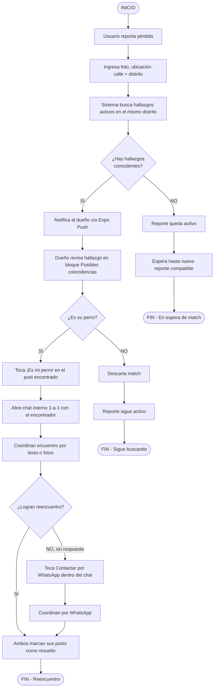
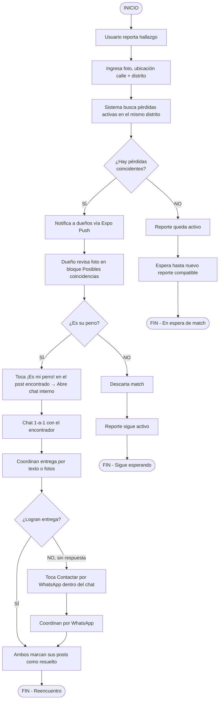
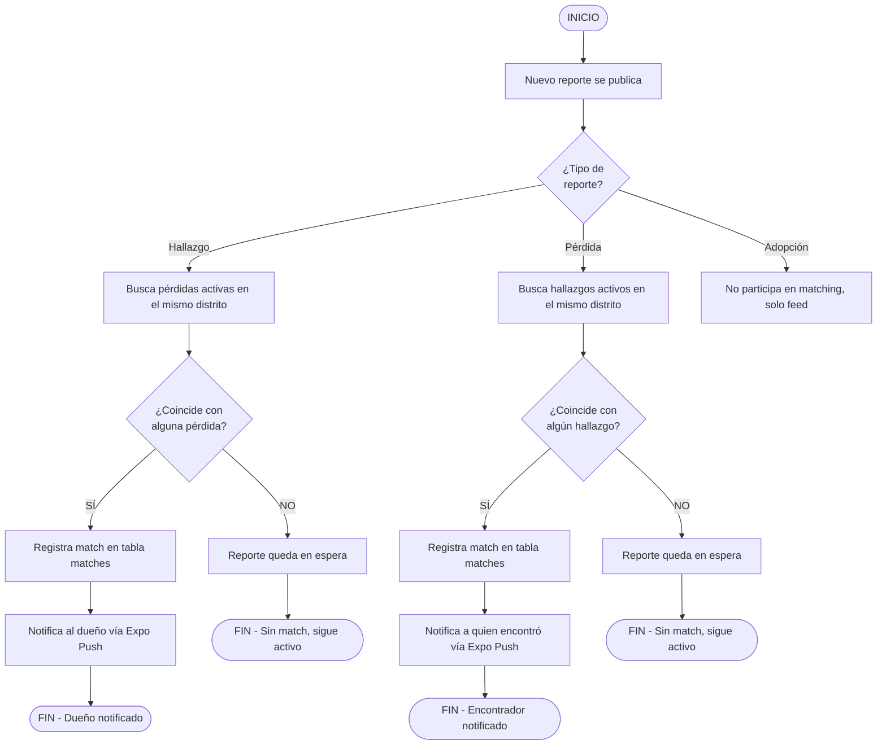
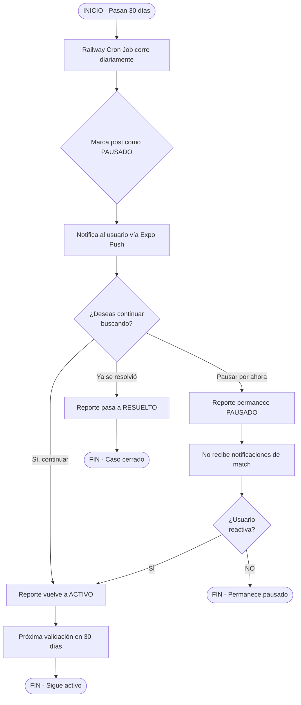
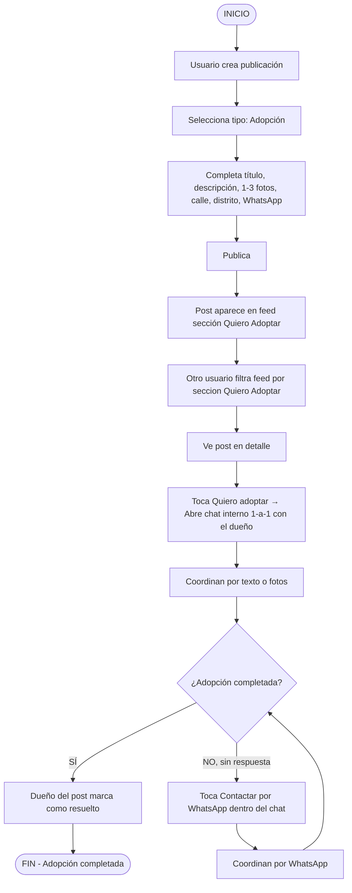
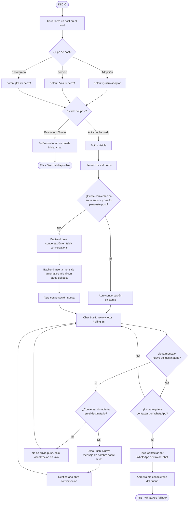
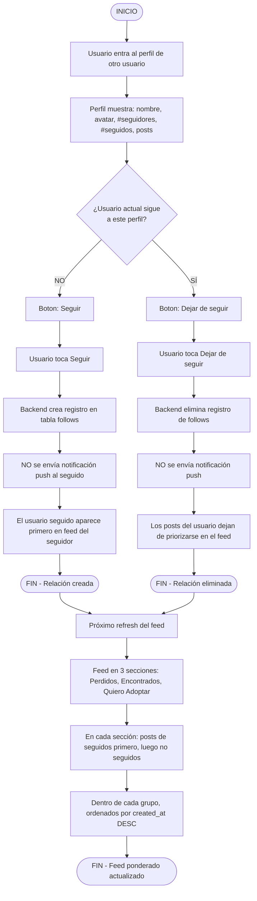
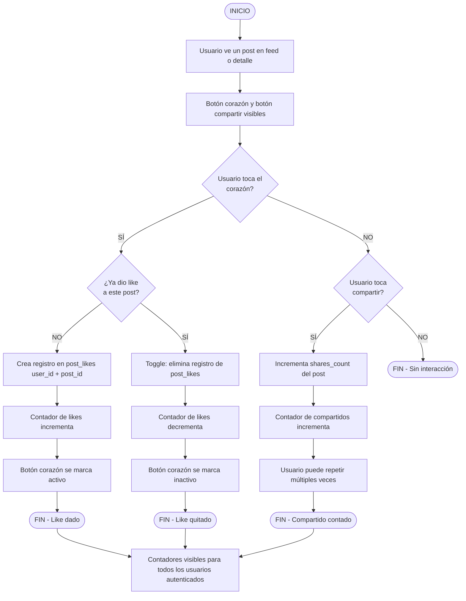

# PetFine - Diagramas de Flujo de Proceso (MVP v3)

> **Documento actualizado — MVP v3 (julio 2026)**
>
> Los diagramas reflejan el alcance de MVP v3: matching automático por **mismo distrito** (no radio geográfico), notificaciones push (Expo Push), validación de 30 días con estado `pausado`, feed en 3 secciones ordenado por seguidos primero, interacciones sociales (likes, shares, follows) y **chat interno iniciado solo desde botones contextualizados del post** con WhatsApp como respaldo dentro del chat.
>
> El tipo **Adopción** no participa en matching. El chat no incluye WebSockets (polling 5s).

---

## Diagrama 1: Reporte de Perro Perdido



---

## Diagrama 2: Reporte de Perro Encontrado



---

## Diagrama 3: Notificación al Publicar Nuevo Reporte (Búsqueda Cruzada)

Este diagrama muestra qué pasa cuando alguien más publica un reporte mientras el tuyo sigue activo.



---

## Diagrama 4: Validación cada 30 Días

Aplica tanto a reportes de pérdida como de hallazgo que siguen activos sin cierre.



---

## Diagrama 5: Publicación de Adopción

El tipo **Adopción** no participa en matching. Es un flujo directo: publicación → feed (sección Quiero Adoptar) → contacto vía chat interno.



---

## Diagrama 6: Chat Interno Iniciado Desde Post (NUEVO v3)

El chat empezará únicamente desde un botón contextualizado de un post. No existe botón de contacto directo en el perfil.



---

## Diagrama 7: Seguir a un Usuario y Feed Ponderado (NUEVO v3)

Los seguidores no cambian el feed en secciones, solo el **orden dentro de cada sección**: posts de seguidos aparecen primero.



---

## Diagrama 8: Like y Compartir en un Post (NUEVO v3)



---

## Diagrama 9: Moderación de Chat por Admin (NUEVO v3)

```mermaid
flowchart TD
    INICIO([INICIO - reporte de chat recibido]) --> A[Admin abre panel de moderación]
    A --> B[Admin ve reporte vinculado a conversación]
    B --> C[Admin abre la conversación en modo SOLO LECTURA]
    C --> D[Admin no puede enviar mensajes]
    D --> E[Admin lee el contexto del chat]

    E --> F{¿Hay mensaje(s)<br/>problemáticos?}
    F -- NO --> G[Admin cierra el reporte sin acción]
    G --> FIN1([FIN - Sin acción])

    F -- SÍ, mensaje individual --> H[Admin elimina mensaje específico]
    H --> I[Mensaje se elimina de la tabla messages]
    I --> J[Resto de la conversación se preserva]
    J --> FIN2([FIN - Mensaje eliminado])

    F -- SÍ, comportamiento sistemático --> K[Admin decide banear al usuario]
    K --> L[Admin marca usuario como baneado]
    L --> M[Perfil del usuario baneado oculto]
    M --> N[Posts del usuario baneado ocultos del feed]
    N --> FIN3([FIN - Usuario baneado])
```

---

## Resumen Visual: Comparación de Escenarios

```mermaid
flowchart LR
    A[Se publica reporte] --> B{¿Tipo?}

    B -- Perdido/Encontrado --> C{¿Match en<br/>mismo distrito?}
    C -- SÍ --> D[Registra match]
    D --> E[Notificación push instantánea de match]
    E --> F[Dueño toca ¡Es mi perro!]
    F --> G[Abre chat interno 1-a-1]
    G --> H[Coordinan por texto o fotos]
    H --> I{¿Logran<br/>reencuentro?}
    I -- SÍ --> J[Ambos marcan resuelto]
    J --> K[FIN - Reencuentro]
    I -- NO --> N[Toca Contactar por WhatsApp dentro del chat]
    N --> O[Coordinan por WhatsApp]
    O --> I

    C -- NO --> P[Reporte activo, sin expirar]
    P --> Q[Espera hasta nuevo reporte compatible]
    Q --> R{¿Alguien publica<br/>algo compatible?}
    R -- SÍ, en cualquier momento --> D
    R -- NO --> S[Validación cada 30 días]
    S --> P

    B -- Adopción --> T[Publicación directa al feed sección Quiero Adoptar]
    T --> U[Sin matching, solo se muestra filtrable]
    U --> V[Usuario toca Quiero adoptar]
    V --> W[Abre chat interno 1-a-1 con el dueño]
    W --> X[Coordinan por texto o fotos, o WhatsApp fallback]
    X --> Y[Dueño del post marca resuelto cuando adopta]
    Y --> Z[FIN - Adopción completada]
```



---

## Notas

- Todos los reportes son **no expirables**: el sistema nunca elimina un reporte por sí solo.
- El cierre de un reporte (match exitoso, adopción completada o abandono) **siempre lo decide el usuario**, nunca el sistema automáticamente.
- La validación de 30 días es solo una **pregunta de seguimiento**, no un cierre forzado. El estado `pausado` bloquea notificaciones de match pero el post sigue accesible desde el perfil.
- **Matching por distrito (MVP v3):** la coincidencia se basa en el string del distrito normalizado (`LOWER(TRIM(distrito))`). No hay lat/lng ni radio geográfico.
- **Push habilitado (MVP v3):** Expo Push se usa para notificaciones de match, validación 30 días, y **nuevos mensajes de chat (NUEVO v3)**. Límite: 600 notificaciones/segundo.
- **Cron job:** Railway Cron Jobs corre diariamente para detectar posts activos con `last_validated_at` > 30 días y marcarlos como `pausado`.
- **Adopción fuera de matching:** el tipo Adopción solo aparece en el feed filtrable y se contacta directamente vía chat interno (botón "Quiero adoptar"), sin participar en el motor de matching.
- **Chat en MVP v3:** implementado con polling REST 5s, sin WebSockets ni Socket.io. Solo texto y fotos. Botones contextualizados visibles en estados `activo` y `pausado`, ocultos en `resuelto` y `oculto`.
- **WhatsApp en v3:** degradado a botón de respaldo **dentro del chat**, no canal primario. No existe botón de contacto directo en el perfil.
- **Seguidores en v3:** relación unidireccional sin notificación push. El feed ordena primero los posts de seguidos dentro de cada sección, sin cambiar las secciones.
- **Likes en v3:** únicos por usuario por post (toggle). Compartidos: sin límite por usuario. Contadores públicos.
